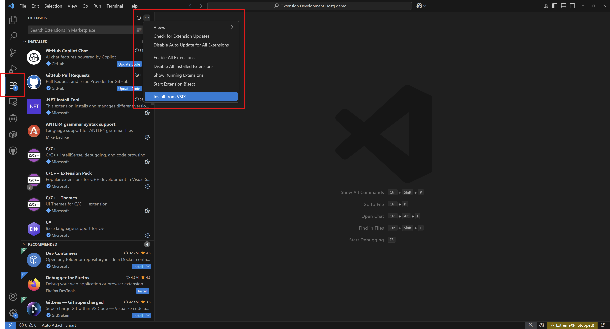
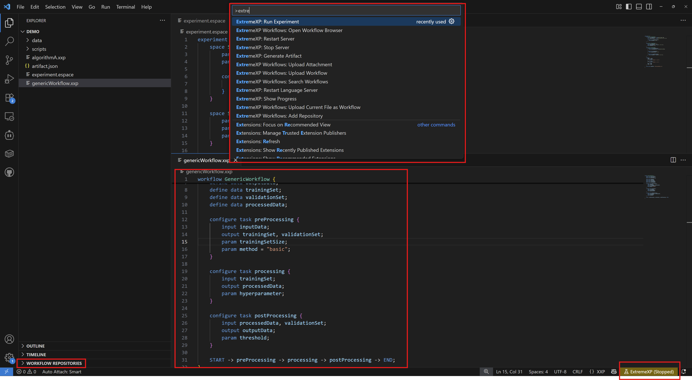

# Installation

The ExtremeXP VS Code Extension ("ExtremeXP - Workflows & Experiments") provides a comprehensive development environment for designing and executing data-driven experiments. It offers robust language support for XXP and ESPACE files, along with integrated experiment execution capabilities.

## Prerequisites

Before installing the ExtremeXP extension, ensure your system meets the following requirements:

* **Visual Studio Code**: Version 1.101.2 or higher.
* **Node.js**: Version 22.0.0 or higher. Some extension features, particularly the bundled tools, rely on a compatible Node.js runtime.
* **npm**: Version 9.0.0 or higher. This is typically installed alongside Node.js and is used for managing Node.js packages.

## Installation Methods

The ExtremeXP VS Code Extension is distributed as a `.vsix` file.

### Method 1: Install from VSIX File

This is the recommended method for installing the ExtremeXP extension.

1.  **Download the VSIX file**: Obtain the `extremexp-vs-code-extension-1.0.0.vsix` file. This file is typically provided alongside the ExtremeXP framework distribution.
2.  **Open Visual Studio Code**.
3.  **Access the Extensions view**: Click on the Extensions icon in the Activity Bar on the side of VS Code, or press `Ctrl+Shift+X` (Windows/Linux) / `Cmd+Shift+X` (macOS).
4.  **Open the installation menu**: In the Extensions sidebar, click the `...` (More Actions) button located in the top-right corner.
5.  **Select "Install from VSIX..."**: From the dropdown menu, choose the "Install from VSIX..." option.
6.  **Browse and select the VSIX file**: A file explorer window will open. Navigate to the directory where you downloaded the `.vsix` file, select it, and click "Install".
7.  **Complete Installation**: VS Code will install the extension. You will see a confirmation message once the installation is successful.
8.  **Restart VS Code**: It is highly recommended to restart Visual Studio Code after installation to ensure all extension components and language services are fully loaded and initialized.

## Post-Installation Setup

Upon successful installation and VS Code restart, the ExtremeXP extension performs several automatic configurations:

### Automatic Setup

* **Language Server**: The dedicated Language Server for XXP and ESPACE is automatically configured and started, providing rich language features.
* **Built-in Tools**: All necessary tools, such as the artifact generator and experiment runner server, are bundled with the extension and configured for immediate use by default.
* **Syntax Highlighting**: Syntax highlighting for `.xxp` and `.espace` files becomes immediately active, enhancing code readability.
* **Command Registration**: All ExtremeXP commands are registered in the VS Code Command Palette, accessible by searching for "ExtremeXP".

### Verification Steps

To verify that the extension is installed and functioning correctly:

1.  **Create a test file**: In VS Code, create a new file and save it with a `.xxp` or `.espace` extension (e.g., `myWorkflow.xxp`).
2.  **Check syntax highlighting**: Paste some sample XXP or ESPACE code into the file. Verify that the file displays appropriate syntax coloring as defined by the languages.
3.  **Test Command Palette**: Open the Command Palette (`Ctrl+Shift+P` / `Cmd+Shift+P`) and type "ExtremeXP". A list of ExtremeXP-specific commands should appear. Try running a command like "ExtremeXP: Generate Artifact" (even if the file is empty, you should see relevant output or an error indicating an empty file).
4.  **Verify extension status**: Go to the Extensions view (`Ctrl+Shift+X` / `Cmd+Shift+X`) and search for "ExtremeXP". Ensure the extension is listed as "Enabled".

## Configuration

The ExtremeXP extension can be customized through Visual Studio Code's settings. To access these settings:

* **Windows/Linux**: Go to `File > Preferences > Settings`.
* **macOS**: Go to `Code > Settings`.
* **Search**: In the Settings search bar, type "ExtremeXP" to filter for all relevant options.

### Tool Configuration

The extension comes bundled with all necessary tools. However, for advanced scenarios, you can configure custom tool paths.

* **`extremexp.tools.useBuiltIn`**
    * **Type**: `boolean`
    * **Default**: `true`
    * **Description**: Controls whether the extension uses its bundled tools (`true`) or external tools configured via custom paths (`false`). It is highly recommended to keep this as `true` unless you have specific development or debugging requirements that necessitate external tool binaries.

#### Custom Tool Paths

If `extremexp.tools.useBuiltIn` is set to `false`, you must configure the following paths to your external tool binaries:

* **`extremexp.tools.artifactgenerator.path`**
    * **Type**: `string`
    * **Default**: `""` (When empty, the built-in tool is used if `useBuiltIn` is true).
    * **Description**: Specifies the absolute path to the custom artifact generator executable.

* **`extremexp.tools.experimentrunnerserver.path`**
    * **Type**: `string`
    * **Default**: `""`
    * **Description**: Specifies the absolute path to the custom experiment runner server executable.

* **`extremexp.tools.languageserver.path`**
    * **Type**: `string`
    * **Default**: `""`
    * **Description**: Specifies the absolute path to the custom language server executable.

### Server Configuration

These settings control the behavior of the integrated experiment runner server.

* **`extremexp.server.port`**
    * **Type**: `number`
    * **Default**: `3000`
    * **Description**: Defines the network port on which the experiment runner server listens for connections. Change this value if port `3000` is already in use by another application on your system.

* **`extremexp.server.autoStart`**
    * **Type**: `boolean`
    * **Default**: `true`
    * **Description**: If `true`, the experiment runner server will automatically start when the ExtremeXP extension is activated in VS Code. Disable this if you prefer to manually start and manage the server process.

### Database Configuration

This setting determines where experiment run data is stored.

* **`extremexp.experiments.defaultDatabase`**
    * **Type**: `string`
    * **Default**: `""` (empty string)
    * **Description**: Specifies a custom absolute path for the SQLite database file where experiment run metadata and results are stored.
        * If left empty, the extension will use a default location within your user's application data directory, specific to your operating system:
            * **Windows**: `%LOCALAPPDATA%/ExtremeXP`
            * **macOS**: `~/Library/Application Support/ExtremeXP`
            * **Linux**: `~/.local/share/extremexp`

## Troubleshooting Installation

This section provides solutions for common installation and setup issues.

### Common Installation Issues

#### Extension Not Loading

**Symptoms**: The ExtremeXP extension appears to be installed, but its commands are not available in the Command Palette, or language features (like syntax highlighting) do not work.

**Solutions**:

* **Restart VS Code**: Close all VS Code windows completely and restart the application.
* **Check VS Code Version**: Ensure your Visual Studio Code version meets the prerequisite (1.101.2 or higher). Update VS Code if necessary.
* **Disable Conflicting Extensions**: Temporarily disable other installed VS Code extensions that might conflict with ExtremeXP, then restart VS Code.
* **Check Developer Console**: Open VS Code's Developer Tools (`Help > Toggle Developer Tools`) and check the "Console" tab for any error messages related to the extension.

#### VSIX Installation Fails

**Symptoms**: An error message appears during the "Install from VSIX..." process.

**Solutions**:

* **Verify VSIX File Integrity**: Ensure the `.vsix` file you downloaded is not corrupted. Try re-downloading it.
* **Permissions**: Verify that VS Code has the necessary write permissions to its extensions folder. On Windows, try running VS Code as an administrator.
* **Clear Cache**: In some rare cases, clearing the VS Code extension cache can help. The cache location is typically `%USERPROFILE%\.vscode\extensions` on Windows.

#### Language Server Not Starting

**Symptoms**: Syntax highlighting, auto-completion, and inline validation for XXP/ESPACE files are not working.

**Solutions**:

* **Node.js Installation**: Confirm that Node.js (version 22.0.0 or higher) is correctly installed and accessible from your system's PATH. Open a terminal and type `node -v` to check.
* **Check Output Panel**: In VS Code, open the Output panel (`View > Output`) and select "ExtremeXP Language Server" from the dropdown. Look for any error messages or diagnostic information.
* **Restart Language Server**: From the Command Palette (`Ctrl+Shift+P` / `Cmd+Shift+P`), search for and execute the "ExtremeXP: Restart Language Server" command.

#### Port Conflicts

**Symptoms**: The experiment runner server fails to start, often with errors indicating that a port is already in use (e.g., port 3000).

**Solutions**:

* **Change Server Port**: Adjust the `extremexp.server.port` setting in VS Code to a different available port number.
* **Identify Conflicting Process**: Use system tools to find out which process is using the specified port.
    * **Windows**: Open Command Prompt and run `netstat -ano | findstr :<PORT_NUMBER>` (e.g., `netstat -ano | findstr :3000`). This will show the process ID (PID) using that port, which you can then look up in Task Manager.
    * **Linux/macOS**: Open Terminal and run `lsof -i :<PORT_NUMBER>` or `sudo netstat -tulpn | grep :<PORT_NUMBER>`.
* **Disable Auto Start**: If conflicts persist or you prefer manual control, set `extremexp.server.autoStart` to `false` and manage the server process externally.

### Getting Installation Help

If you encounter issues not covered in this guide, please follow these steps to report the problem effectively:

1.  **Check Extension Output**: Always begin by examining the "ExtremeXP" and "ExtremeXP Language Server" output channels in VS Code's Output panel (`View > Output`) for detailed error messages or logs.
2.  **Verify All Prerequisites**: Double-check that your VS Code, Node.js, and npm versions meet the minimum requirements.
3.  **Perform a Clean Installation**: Uninstall the ExtremeXP extension, restart VS Code, and then attempt a fresh installation.
4.  **Report Issues**: If the problem persists, please submit a detailed bug report to the project's GitHub repository (or designated issue tracker). Include the following information:
    * Your Visual Studio Code version.
    * Your operating system (e.g., Windows 10, macOS Sonoma, Ubuntu 22.04).
    * The ExtremeXP extension version.
    * Any specific error messages or relevant logs from the VS Code Output panel or Developer Tools.
    * Steps to reproduce the issue (if applicable).

## Next Steps

Once the ExtremeXP extension is successfully installed and verified, you are ready to begin designing and executing your experiments:

1.  **Learn the Languages**: Familiarize yourself with the core concepts and syntax of the [Domain-Specific Languages](domain-specific-languages.md) (XXP and ESPACE).
2.  **Explore Language Features**: Discover the rich IDE capabilities provided by the extension, such as syntax highlighting, auto-completion, and validation, in the [VS Code Extension](language-features.md) documentation.
3.  **Create Your First Experiment**: Follow the guides on [Executing Experiments](executing-experiments.md) to generate artifacts and run your first data-driven experiment.
4.  **Set Up Repositories**: For collaborative projects, configure and utilize the [Workflow Repository Server](workflow-repositories.md) to share and manage your experiment definitions.

> **Note**: Links to sample XXP and ESPACE files or quick-start templates would go here to help users get started quickly.