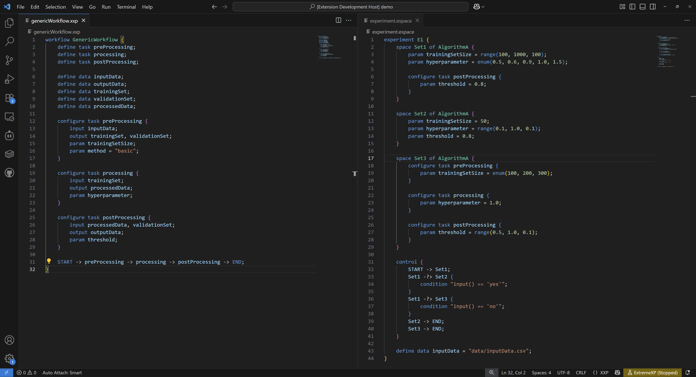
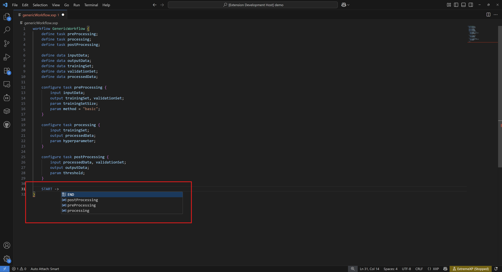

# Language Features

The ExtremeXP VS Code Extension provides comprehensive language support for both XXP and ESPACE files. This includes intelligent editing features, real-time validation, and seamless multi-file project support. The extension automatically discovers related workflow files across your folder and efficiently resolves imports and dependencies between them.

## Syntax Highlighting

The extension provides intuitive, color-coded syntax highlighting that significantly improves the readability of your XXP and ESPACE code. Different elements such as language keywords (`workflow`, `define`, `param`), identifiers (workflow names, task names, data variables), strings, numbers, booleans, comments (`//`), and operators (`->`, `-?>`, `=`) are visually distinguished with distinct colors. This clear visual differentiation helps you quickly grasp the structure and components of your experiment definitions.

## Auto-completion and IntelliSense

The ExtremeXP extension offers intelligent auto-completion and IntelliSense features to boost your coding efficiency and accuracy. As you type, the extension provides context-aware suggestions for:

* **Language keywords**: Guiding you through the syntax.
* **Task names**: Listing available tasks within the current or inherited workflow.

You can trigger IntelliSense manually by pressing `Ctrl+Space` (Windows/Linux) or `Cmd+Space` (macOS) to see all relevant suggestions based on your current cursor position and workflow definition.

## Real-time Validation

The extension performs continuous, real-time validation of your XXP and ESPACE files as you type. It immediately detects both syntax errors (e.g., missing semicolons, incorrect keywords) and semantic errors (e.g., referencing an undefined task, incorrect parameter usage).

Detected errors and warnings are clearly indicated:

* **Red underlines**: Invalid code segments are marked with a red wavy underline.
* **Detailed error messages**: Hovering over an underlined section displays a tooltip with a descriptive error message explaining the problem.
* **Problems panel**: All errors and warnings are aggregated in VS Code's "Problems" panel (`View > Problems`), allowing for easy review and navigation directly to the problematic lines of code.

## Context-Aware Help

Gain quick access to documentation and relevant information directly within your editor. By hovering your mouse cursor over various language elements (e.g., keywords, task names, parameter names), the extension displays a rich hover tooltip. This tooltip can include:

* Task summaries.
* Expected parameter types.
* Usage examples.
* Relevant documentation snippets.

This feature allows you to get help without interrupting your coding flow or leaving the editor.

## Navigation Features

The ExtremeXP extension integrates deeply with VS Code's powerful navigation capabilities, enabling you to explore and understand your experiment definitions efficiently, especially in multi-file projects.

### Go to Definition

Quickly navigate to the source of any symbol's definition.

* **Usage**: Right-click on a task name, parameter, workflow name, or data variable and select "Go to Definition", or simply press `F12`.
* **Shortcut**: `Ctrl+Click` (Windows/Linux) / `Cmd+Click` (macOS) directly on the symbol.
* This will open the file where the symbol was originally defined, providing instant context.

### Find All References

Locate every instance where a specific symbol is used throughout your entire project.

* **Usage**: Right-click on a symbol and select "Find All References", or press `Shift+F12`.
* **Results**: The results appear in a dedicated "References" panel, allowing you to preview the usage context and navigate directly to each reference.

## Refactoring Support

The extension offers basic refactoring capabilities to help you maintain and evolve your experiment definitions with ease.

* **Rename Symbol**: Use the "Rename Symbol" feature to safely rename tasks, parameters, and workflows across multiple files.
    * **Usage**: Place your cursor on the symbol you wish to rename, then press `F2` or right-click and select "Rename Symbol". Enter the new name, and the extension will automatically update all references to that symbol throughout your workspace.

## Language Server Management

The ExtremeXP extension operates through a dedicated language server that provides all the intelligent language features. In rare cases, if you experience issues with these features, you may need to manage the language server directly.

### ExtremeXP: Restart Language Server (`extremexp.restartLanguageServer`)

This command forces the language server process to restart. It can be useful if you encounter:

* Unexpected behavior with language features (e.g., auto-completion not working, incorrect diagnostics).
* Issues after manually editing configuration files that the language server might not have picked up automatically.

* **Usage**: Open the VS Code Command Palette (`Ctrl+Shift+P` / `Cmd+Shift+P`), type "ExtremeXP: Restart Language Server", and select the command.

### Troubleshooting Language Features

If your language features (syntax highlighting, IntelliSense, validation) are not working as expected:

1.  **Check File Extensions**: Ensure your experiment files are correctly saved with `.xxp` or `.espace` extensions.
2.  **Verify Prerequisites**: Confirm that Node.js (version 22.0.0 or higher) is properly installed on your system.
3.  **Check Output Channel**: Open VS Code's Output panel (`View > Output`) and select "ExtremeXP Language Server" from the dropdown. Look for any error messages or diagnostic information that might indicate a problem with the server's startup or operation.
4.  **Restart Language Server**: Try running the "ExtremeXP: Restart Language Server" command as described above.
5.  **Reinstall Extension**: As a last resort, uninstall the ExtremeXP extension, restart VS Code, and then reinstall it.

## Next Steps

With a firm grasp of the ExtremeXP language features, you're well-equipped to create sophisticated experiment definitions:

1.  **Create Experiments**: Learn how to generate executable artifacts and run your experiments using the framework by consulting the [Executing Experiments](executing-experiments.md) guide.
2.  **Collaborate**: Discover how to share and manage your experiment workflows with others using [Workflow Repositories](workflow-repositories.md).
3.  **Advanced Usage**: Explore more complex workflow patterns and optimization techniques as you become more proficient with the framework.
